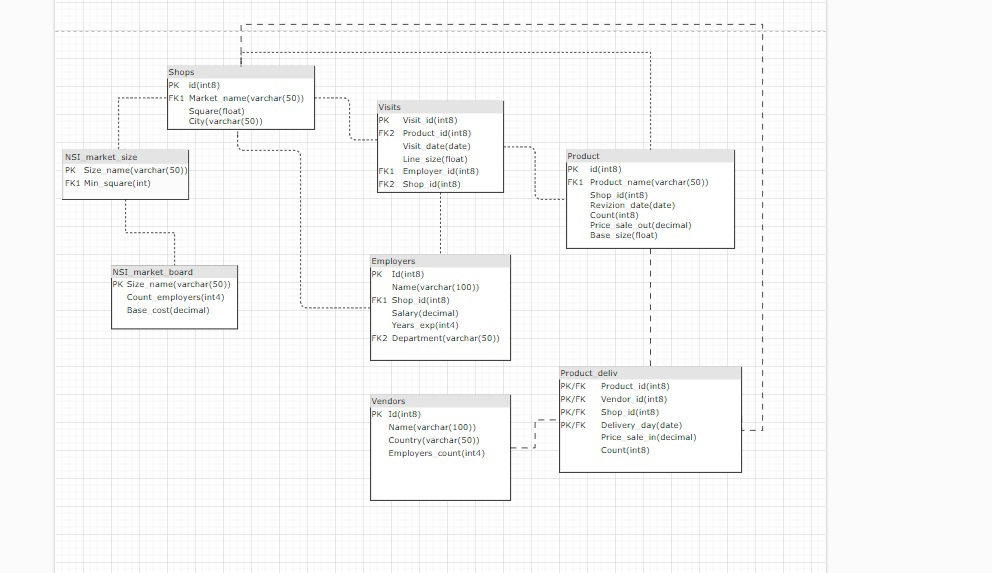

# PostgreSQL project
This project demonstrates a practical application of relational databases using SQL and PostgreSQL, with an integration of Python for data visualization. The project covers core concepts of relational database design, SQL querying, and database management with PostgreSQL. Using Python, queries are executed and visualized to provide insights from the data.

Этот проект демонстрирует создание и управление реляционной базой данных с использованием SQL и PostgreSQL, а также интеграцию с Python для визуализации запросов и анализа данных.

# Описание проекта
Проект включает в себя основные этапы разработки и использования реляционной базы данных:
- Создание структуры базы данных с использованием DDL-скриптов.
- Загрузка данных в базу из файла дампа.
- Обработка запросов на Python для дальнейшей визуализации и анализа данных.

# Содержание
- **`ddl_plus_NSI.txt`**: скрипт для создания базы данных и справочников (DDL).
- **`dump2.sql`**: SQL-дамп с демонстрационными данными.
- **`Запросы в БД.sql`**: выполненные запросы в среде PostgreSQL.
- **`ER-модель.jpg`**: ER-модель базы данных.
- **Описание БД**: описание структуры и логики базы данных.
- **`pythonProject`**: проект, включающий скрипты с подключением к базе данных и три запроса с визуализацией.

  ## ER-модель

# Запросы к базе данных

1. **Выборка сотрудников**: получение уникального номера сотрудника, зарплаты, департамента и имени из таблицы `Сотрудники`.

2. **Общая стоимость товаров**: получение общей стоимости всех товаров (имя товара, магазин, дата ревизии, общая стоимость) из таблицы `Продукты`, где общая стоимость превышает 5000.

3. **Максимальная общая стоимость**: поиск магазина и даты ревизии с наибольшей общей стоимостью всех товаров из таблицы `Продукты`.

4. **Зарплата сотрудников**: вывод базового оклада и текущей зарплаты для каждого сотрудника.

5. **Визиты сотрудников**: вывод информации о каждом визите сотрудника, включая дату визита, магазин, опыт сотрудника и департамент.

6. **Средняя зарплата по типу магазина**: вывод средней зарплаты сотрудников для каждого типа магазина и базового оклада. Сотрудники, получающие больше базового оклада, помечаются как "переплата", остальные — как "зп по рынку".

7. **Средняя зарплата сотрудников**: вывод средней зарплаты сотрудников для каждого типа магазина и базового оклада.

8. **Число поставщиков**: подсчет количества различных поставщиков товарного ассортимента для каждой ревизии.

## Примечания

- Для получения дополнительной информации о структуре базы данных обратитесь к файлу **Описание БД**.
- ER-модель визуализирует взаимосвязи между таблицами базы данных, что может быть полезно для понимания её структуры.
